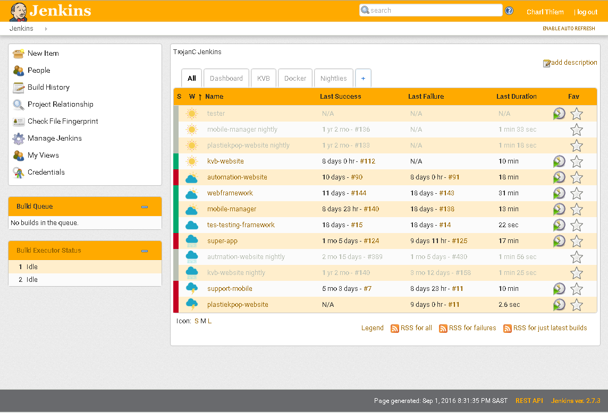

# jenkins-theme 

A non-intrusive theme for Jenkins. Other themes try to do too much and end up breaking more of the UI, instead of making it look nicer.

The purpose of this project is to create a customizable theme that works.

## Screenshot

**Don't worry you can change the primary color!** 
Weather icons by [Freepick @ Flaticon.com](http://www.flaticon.com/packs/weather-4)

## Building the Theme

1. Clone this repository

2. Customize by editing `_institution.scss` with your settings

3. `npm install && npm run build`

4. Compiled asset in `dist` directory

## Installation

### Building from source

1. Host the compiled files

2. Install [Jenkins Simple Theme Plugin][simple]

3. Click `Manage Jenkins`

4. Click `Configure System` and scroll down to `Theme`

5. Set path to where you are hosting the files

6. Click `Save`

### Flaticons
If you are interested in using an other "weather" icon set. Download it and place it in the `src/images` directory
Required icons are:
- cloud.png
- cloudy.png
- rain.png
- storm.png
- sun.png

In your institution.scss file, enable weather icons by setting `$weather-icons: true;`

# License
This project is provided under the GPL-3.0 license.
